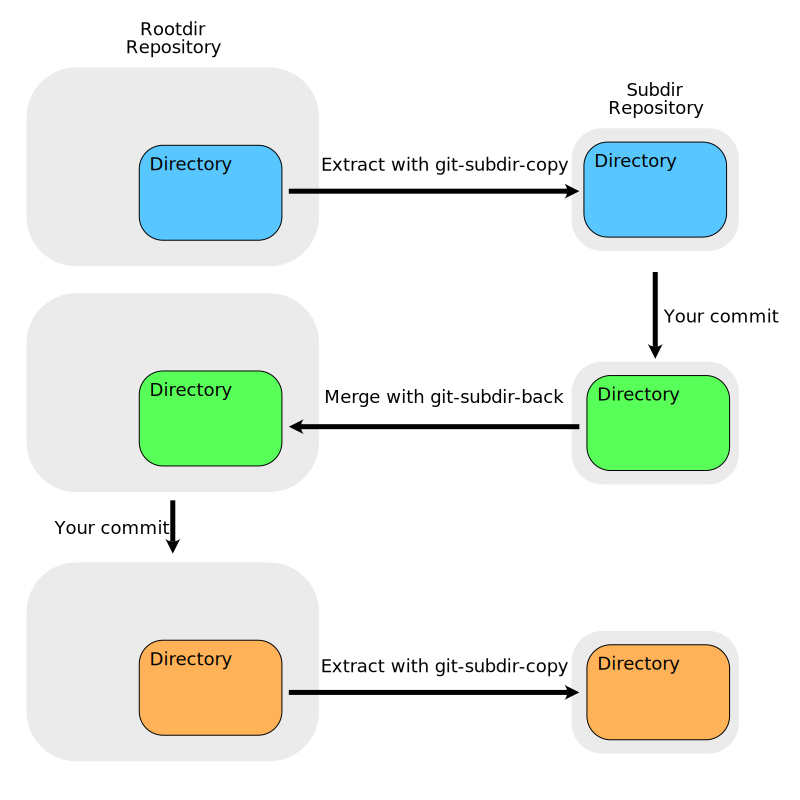

<!-- PROJECT SHIELDS -->
[![Contributors][contributors-shield]][contributors-url]
[![Forks][forks-shield]][forks-url]
[![Stargazers][stars-shield]][stars-url]
[![Issues][issues-shield]][issues-url]
[![MIT License][license-shield]][license-url]
<!-- [![LinkedIn][linkedin-shield]][linkedin-url] -->


<!-- PROJECT LOGO -->
<br />
<p align="center">
<!--
TODO: logo
  <a href="https://github.com/anatawa12/git-subdir-tools">
    
  </a>
-->

  <h3 align="center">git-subdir-tools</h3>
</p>

<p align="center">
  The tools and github action to extract commits of some directories of a repository <br />
  to another repository and return merge to source repository.
  <br />
  <a href="https://github.com/anatawa12/git-subdir-tools"><strong>Explore the docs »</strong></a>
  <br />
  <br />
<!--
  <a href="https://github.com/anatawa12/git-subdir-tools">View Demo</a>
  ·
-->
  <a href="https://github.com/anatawa12/git-subdir-tools/issues">Report Bug</a>
  ·
  <a href="https://github.com/anatawa12/git-subdir-tools/issues">Request Feature</a>
  <br />
  
</p>


<!-- TABLE OF CONTENTS -->
## Table of Contents

* [About the Project](#about-the-project)
  * [Built With](#built-with)
* [Getting Started](#getting-started)
  * [Prerequisites](#prerequisites)
  * [Installation](#installation)
* [Usage](#usage)
* [Roadmap](#roadmap)
* [Contributing](#contributing)
* [License](#license)
* [Contact](#contact)
* [Acknowledgements](#acknowledgements)


<!-- ABOUT THE PROJECT -->
## About The Project

This project is for reduce to clone huge repository.
Some repositories like DefinitelyTyped or intellij-community has contain small projects but git cannot fetch only some directories.
So I came up with an idea, extract some directories from huge repository.

In this tool, huge repository will be called "rootdir repository" and extracted (small) repository will be called "subdir repository".

### Built With

* [libgit2Sharp](https://github.com/libgit2/libgit2sharp) to control basic operations of git
* [git](https://git-scm.com) to shallow fetch
* [ShellProgressBar](https://github.com/Mpdreamz/shellprogressbar) to show progressbar
* [dotnet](https://dot.net) as a runtime and build system
* [C#](https://docs.microsoft.com/en-us/dotnet/csharp/) main programming language


<!-- GETTING STARTED -->
## Getting Started

To get a local copy up and running follow these simple steps.

#### extract some directory from big repository
```sh
# clone big repository
git clone <big repository url> <path to big repository>
# create subdir (small) repository
mkdir <path to subdir repository>
cd <path to subdir repository>
git init
git remote origin <url to subdir repository>
cd -
# and copy commits!
git-subdir-copy \
    -r <path to rootdir repository> \
    -s <path to subdir repository> \
    -d <path to some directory> \
    -c <path to cache directory> \
    --rootdir-repo-desc jetbrains/intellij-community
```

#### merge to big repository
```sh
# git-subdir-back will merge new commits and branches to big repository
git-subdir-back \
    -r <path to rootdir repository> \
    -s <path to subdir repository> \
    -d <path to some directory> \
    -c <path to cache directory> \
    --rootdir-repo-desc jetbrains/intellij-community
```

### Prerequisites

* (for build) dotnet 5 (currently preview)
```sh
brew cask install dotnet-sdk-preview
```
for other platforms, please install from https://dotnet.microsoft.com/download/dotnet/5.0.

* (for execute) dotnet core 3.1 or later
```sh
brew cask install dotnet
```
for other platforms, please install from https://dotnet.microsoft.com/download/dotnet-core/3.1.

### Installation

Currently this project is not published to nuget.org.

1. Clone the repo
```sh
git clone https://github.com/anatawa12/git-subdir-tools.git
```
2. build and install!
for linux or macos:
```sh
./for-local-install.sh
```
for windows:
```sh
for-local-install
```


<!-- USAGE EXAMPLES -->
## Usage

Here is a gif which is extracting FernFlower decompiler engine from intellij-community repository.

intellij-community repository is 3.6GB and extracted FernFlower decompiler repository is only 47MB.

![Product Name Screen Shot][product-screenshot]

here is a repository extracted FernFlower repository from this tool: [anatawa12/intellij-decompiler-engine](https://github.com/anatawa12/intellij-decompiler-engine)

<!-- _For more examples, please refer to the [Documentation](https://example.com)_ -->


<!-- ROADMAP -->
## Roadmap

See the [open issues](https://github.com/anatawa12/git-subdir-tools/issues) for a list of proposed features (and known issues).


<!-- CONTRIBUTING -->
## Contributing

Contributions are what make the open source community such an amazing place to be learn, inspire, and create. Any contributions you make are **greatly appreciated**.

1. Fork the Project
2. Create your Feature Branch (`git checkout -b feature/AmazingFeature`)
3. Commit your Changes (`git commit -m 'Add some AmazingFeature'`)
4. Push to the Branch (`git push origin feature/AmazingFeature`)
5. Open a Pull Request

<!-- LICENSE -->
## License

Distributed under the MIT License. See `LICENSE` for more information.


<!-- CONTACT -->
## Contact

anatawa12 - [@kakerigawa](https://twitter.com/kakerigawa) <!-- - email TODO: add email -->

Project Link: [https://github.com/anatawa12/git-subdir-tools](https://github.com/anatawa12/git-subdir-tools)


<!-- ACKNOWLEDGEMENTS -->
## Acknowledgements

* [Best-README-Template](https://github.com/othneildrew/Best-README-Template) this readme is written based on this template.


<!-- MARKDOWN LINKS & IMAGES -->
<!-- https://www.markdownguide.org/basic-syntax/#reference-style-links -->
[contributors-shield]: https://img.shields.io/github/contributors/anatawa12/git-subdir-tools.svg?style=flat-square
[contributors-url]: https://github.com/anatawa12/git-subdir-tools/graphs/contributors
[forks-shield]: https://img.shields.io/github/forks/anatawa12/git-subdir-tools.svg?style=flat-square
[forks-url]: https://github.com/anatawa12/git-subdir-tools/network/members
[stars-shield]: https://img.shields.io/github/stars/anatawa12/git-subdir-tools.svg?style=flat-square
[stars-url]: https://github.com/anatawa12/git-subdir-tools/stargazers
[issues-shield]: https://img.shields.io/github/issues/anatawa12/git-subdir-tools.svg?style=flat-square
[issues-url]: https://github.com/anatawa12/git-subdir-tools/issues
[license-shield]: https://img.shields.io/github/license/anatawa12/git-subdir-tools.svg?style=flat-square
[license-url]: https://github.com/anatawa12/git-subdir-tools/blob/master/LICENSE.txt
<!-- no linkedln 
[linkedin-shield]: https://img.shields.io/badge/-LinkedIn-black.svg?style=flat-square&logo=linkedin&colorB=555
[linkedin-url]: https://linkedin.com/in/<linkedln-account>
-->
[product-screenshot]: ./md-resources/git-subdir-tools-demo.gif
